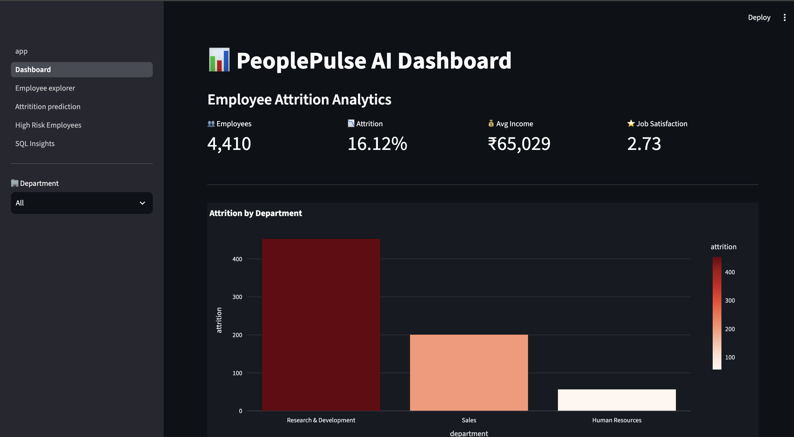
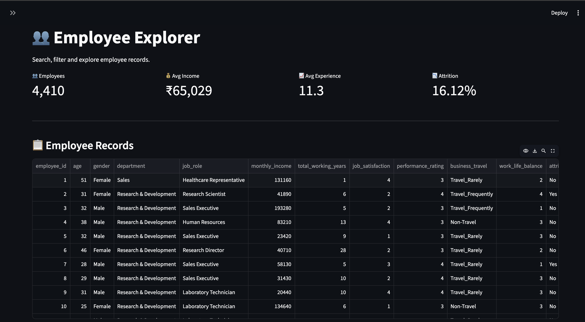
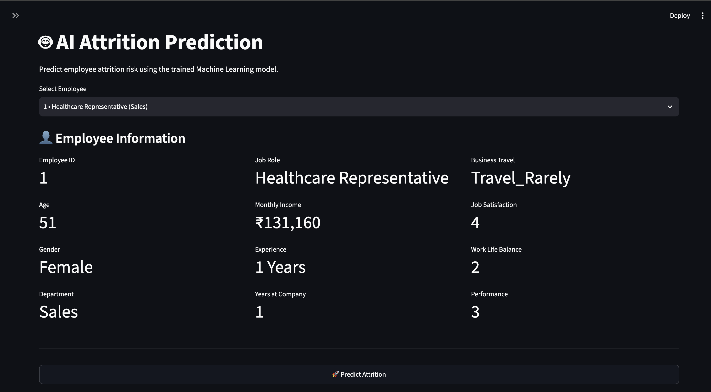
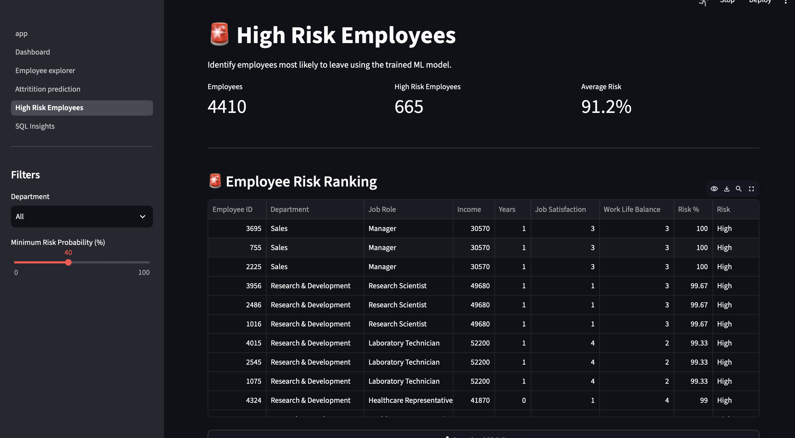
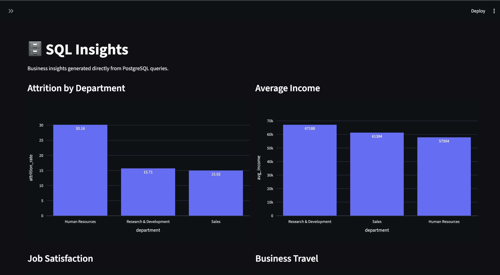

# 👥 PeoplePulse AI

<div align="center">

### AI-Powered HR Analytics & Employee Attrition Prediction Platform

Analyze workforce trends, identify high-risk employees, and generate actionable business insights using **SQL, Python, Machine Learning, and Interactive Dashboards**.


</div>

---

# 📖 Overview

**PeoplePulse AI** is an end-to-end HR Analytics platform built to help organizations understand workforce trends and proactively identify employees who are at risk of leaving.

The project combines **SQL, Data Analysis, Machine Learning, and Interactive Dashboards** to transform employee data into meaningful business insights.

Instead of only visualizing historical HR data, the application also predicts employee attrition using a trained **Random Forest Classifier**, enabling HR teams to make proactive retention decisions.

---

# 🚀 Features

## 📊 Executive Dashboard

Monitor important HR KPIs through an interactive dashboard.

### Includes

- Total Employees
- Attrition Rate
- Average Monthly Income
- Employee Satisfaction
- Department-wise Employee Distribution
- Interactive Visualizations

---

## 👥 Employee Explorer

Explore employee records using dynamic filters.

### Features

- Department Filter
- Gender Filter
- Job Role Filter
- Attrition Filter
- Employee Search
- Export Filtered Records

---

## 🤖 Attrition Prediction

Predict employee attrition using Machine Learning.

### Features

- Employee Selection
- Attrition Probability
- Risk Classification
- HR Recommendations
- Employee Snapshot

---

## 🚨 High Risk Employees

Identify employees with the highest probability of attrition.

### Features

- Employee Risk Ranking
- Department Filtering
- Risk Percentage Filter
- Download CSV Report
- Workforce Risk Summary

---

## 🗄 SQL Insights

Business intelligence reports generated directly using PostgreSQL.

### Insights

- Department-wise Attrition
- Average Salary Analysis
- Job Satisfaction Distribution
- Business Travel Trends

---

# 🏗 Project Architecture

```
                   Employee Dataset
                          │
                          ▼
                Data Cleaning (Python)
                          │
                          ▼
               Feature Engineering
                          │
                          ▼
              PostgreSQL Database
                          │
          ┌───────────────┼───────────────┐
          ▼               ▼               ▼
      SQL Queries    Dashboard      ML Prediction
          │               │               │
          └───────────────┼───────────────┘
                          ▼
                  Streamlit Application
```

---

# 🛠 Tech Stack

## Languages

- Python
- SQL

## Database

- PostgreSQL

## Data Analysis

- Pandas
- NumPy

## Machine Learning

- Scikit-Learn
- Random Forest Classifier

## Dashboard

- Streamlit
- Plotly

---

# 📂 Project Structure

```
PeoplePulseAI
│
├── app
│   ├── app.py
│   ├── database.py
│   ├── prediction.py
│   ├── charts.py
│   ├── utils.py
│   │
│   ├── assets
│   │     └── style.css
│   │
│   └── pages
│         ├── 1_Dashboard.py
│         ├── 2_Employee_Explorer.py
│         ├── 3_Attrition_Prediction.py
│         ├── 4_High_Risk_Employees.py
│         └── 5_SQL_Insights.py
│
├── data
│
├── models
│   ├── attrition_model.pkl
│   └── label_encoders.pkl
│
├── python
│
├── sql
│
├── screenshots
│   ├── dashboard.png
│   ├── employee_explorer.png
│   ├── attrition_prediction.png
│   ├── high_risk_employees.png
│   └── sql_insights.png
│
├── README.md
├── requirements.txt
└── .gitignore
```

---

# ⚙ Machine Learning Workflow

### Data Preparation

- Data Cleaning
- Missing Value Handling
- Duplicate Removal
- Feature Engineering

### Engineered Features

- Age Group
- Income Band
- Experience Level
- Promotion Status
- Frequent Traveler
- Long Commute
- High Salary Hike

### Model

- Random Forest Classifier

### Prediction

The trained model predicts the probability of employee attrition based on employee demographics, work environment, salary, travel frequency, experience, and satisfaction metrics.

---

# 🗄 SQL Analysis

Business insights are generated using PostgreSQL.

Some analytical queries include:

- Department-wise Attrition Rate
- Average Income by Department
- Employee Distribution
- Business Travel Analysis
- Job Satisfaction Analysis
- Workforce Statistics

---

# 📊 Application Screenshots

## 📌 Dashboard



---

## 👥 Employee Explorer



---

## 🤖 Attrition Prediction



---

## 🚨 High Risk Employees



---

## 🗄 SQL Insights



---

# 💼 Business Questions Answered

This project helps answer important HR questions such as:

- Which department has the highest employee attrition?
- Which employees are most likely to leave?
- Does salary influence employee retention?
- How does business travel affect attrition?
- Which departments require HR intervention?
- Which employees should HR prioritize?

---

# 📦 Installation

## Clone Repository

```bash
git clone https://github.com/yourusername/PeoplePulseAI.git
```

---

## Navigate to Project

```bash
cd PeoplePulseAI
```

---

## Create Virtual Environment

```bash
python -m venv venv
```

---

## Activate Virtual Environment

### Windows

```bash
venv\Scripts\activate
```

### macOS/Linux

```bash
source venv/bin/activate
```

---

## Install Dependencies

```bash
pip install -r requirements.txt
```

---

## Configure Environment Variables

Create a `.env` file.

```env
DB_HOST=localhost
DB_PORT=5432
DB_NAME=peoplepulse
DB_USER=your_username
DB_PASSWORD=your_password
```

---

## Run Application

```bash
streamlit run app/app.py
```

---

# 🎯 Future Improvements

- SHAP Model Explainability
- XGBoost Model Comparison
- Employee Retention Forecasting
- Department Benchmarking
- PDF Report Generation
- Cloud Deployment
- Automated HR Alerts

---

# 📈 Skills Demonstrated

- Data Cleaning
- Exploratory Data Analysis
- Feature Engineering
- SQL
- PostgreSQL
- Machine Learning
- Predictive Analytics
- Dashboard Development
- Business Intelligence
- Data Visualization

---

# 👨‍💻 Author

**Vansh Thapa**

- GitHub: https://github.com/yourusername
- LinkedIn: https://linkedin.com/in/yourprofile

---

<div align="center">

### ⭐ If you found this project helpful, consider giving it a star!

</div>
